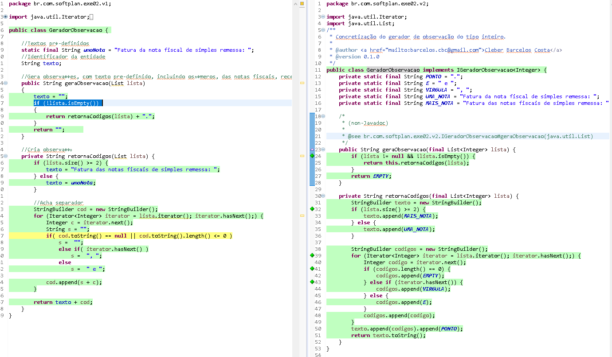

# Exercício 02
Este exercício tem como objetivo elencar alguns pontos que poderia melhor o código de forma a tornar mais seguro e mais otimizado, maximizando recursos de infra e melhorando a legibilidade do código.
### Auditoria
* Uso de variáveis globais compartilhando o escopo e permitindo acesso indevido.;
	```java
	String texto;
	```
* Não utiliza objetos imutável quando passado como parâmetro;
	```java
	public String geraObservacao(List lista)
	private String retornaCodigos(List lista)
	```
* Concatenação de string, causa um desperdício de memória, pois a cada concatenação e feito uma cópia do array.
	```java
	retornaCodigos(lista) + ".";
	cod.append(s + c);
	return texto + cod;
	```
* Nome de variáveis não representativos;
	```java
	Integer c = iterator.next();
	String s = "";
	```
* Condição que nunca vai acontecer; 
	```java
	cod.toString() == null
	```
* Endentação do código incorreta dificultando a legibilidade do código; 
	```java
	if( cod.toString() == null || cod.toString().length() <= 0 )
		s =  "";
		else if( iterator.hasNext() )
			s =  ", ";
		else
			s =  " e ";
	```
* Uso desnecessário do toString();
	```java
	cod.toString().length() <= 0
	```
* Uso de objetos genéricos;
	```java
	List lista
	```
* Falta de validação caso a lista seja null, vai ocorrer um nullpointer;
	```java
	if (!lista.isEmpty()) 
	```
### Arquivos fornecidos

* /src/main/java/br/com/softplan/exe02/v1/GeradorObservacao.java
* /src/test/java/br/com/softplan/exe02/v1/GeradorObservacaoTest.java

### Arquivos após o refactoring

* /src/main/java/br/com/softplan/exe02/v2/GeradorObservacao.java
* /src/main/java/br/com/softplan/exe02/v2/IGeradorObservacao.java
* /src/test/java/br/com/softplan/exe02/v2/GeradorObservacaoTest.java

### Cobertura dos testes


### Execução dos testes
```cmd
mvn test

[INFO] Scanning for projects...
[INFO]                                                                         
[INFO] ------------------------------------------------------------------------
[INFO] Building Exercio 2 0.0.1
[INFO] ------------------------------------------------------------------------
[INFO] 
[INFO] --- maven-resources-plugin:2.6:resources (default-resources) @ exercicio-02 ---
[WARNING] Using platform encoding (UTF-8 actually) to copy filtered resources, i.e. build is platform dependent!
[INFO] Copying 0 resource
[INFO] 
[INFO] --- maven-compiler-plugin:3.1:compile (default-compile) @ exercicio-02 ---
[INFO] Nothing to compile - all classes are up to date
[INFO] 
[INFO] --- maven-resources-plugin:2.6:testResources (default-testResources) @ exercicio-02 ---
[WARNING] Using platform encoding (UTF-8 actually) to copy filtered resources, i.e. build is platform dependent!
[INFO] Copying 0 resource
[INFO] 
[INFO] --- maven-compiler-plugin:3.1:testCompile (default-testCompile) @ exercicio-02 ---
[INFO] Changes detected - recompiling the module!
[WARNING] File encoding has not been set, using platform encoding UTF-8, i.e. build is platform dependent!
[INFO] Compiling 3 source files to D:\Projeto\fontes\sofplan-test\exercicio-02\target\test-classes
[INFO] 
[INFO] --- maven-surefire-plugin:2.12.4:test (default-test) @ exercicio-02 ---
[INFO] Surefire report directory: D:\Projeto\fontes\sofplan-test\exercicio-02\target\surefire-reports

-------------------------------------------------------
 T E S T S
-------------------------------------------------------
Running br.com.softplan.exe02.v1.GeradorObservacaoTest
Tests run: 4, Failures: 0, Errors: 0, Skipped: 0, Time elapsed: 0.367 sec
Running br.com.softplan.exe02.v2.GeradorObservacaoTest
Tests run: 5, Failures: 0, Errors: 0, Skipped: 0, Time elapsed: 0.001 sec

Results :

Tests run: 9, Failures: 0, Errors: 0, Skipped: 0

[INFO] ------------------------------------------------------------------------
[INFO] BUILD SUCCESS
[INFO] ------------------------------------------------------------------------
[INFO] Total time: 22.830 s
[INFO] Finished at: 2018-07-03T23:27:20-03:00
[INFO] Final Memory: 14M/122M
[INFO] ------------------------------------------------------------------------

```	


